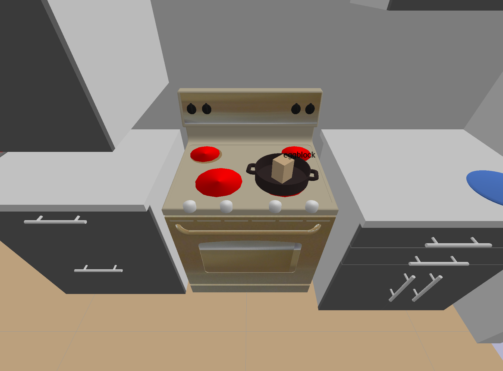

# kitchen-worlds


A collection of kitchen scenes in LISDF format (an extension to SDF that includes URDF), kitchen object models, and TAMP problems. A product of LIS TAMP I/O Hackathon 03/25/2022.

## Setup

Grab the [lisdf](https://github.com/Learning-and-Intelligent-Systems/lisdf) package, developed by William Shen, Nishanth Kumar, Aidan Curtis, and Jiayuan Mao. Follow these steps:

```shell
cd kitchen-worlds
git submodule init
cd lisdf
git checkout jiayuan
git pull
pip install -r requirements.txt
```

## Examples

The kitchen scenes are in path `asset/scenes/`.

To test parsing of LISDF files, run

```shell
python parse_lisdf.py
```

To test loading LISDF worlds into PyBullet, run

```shell
python pybullet_lisdf.py
```

## LISDF Spec

Current kitchen scenes in the format of  `.lisdf` are in path `asset/scenes/`, e.g. `kitchen_counter.lisdf` as simulated below. The LISDF format has a few additional tags inside `<world></world>` compared to [SDF](http://sdformat.org/spec?ver=1.9&elem=sdf):

* add object and robot models with 
  ```xml
  <include>
      <uri>URDF_file</uri>
      <static>true/false</static>
      <pose>x y z r p y</pose>
      <scale> an integer to scale model .obj with original ratio</scale>
  </include>
  ```
* describe camera pose in a way that's easy to export from PyBullet

  ```xml
  <gui>
    <camera name="default_camera" definition_type="lookat">
      <xyz>3 6 3</xyz>
      <point_to>0 6 1</point_to>
    </camera>
  </gui>
  ```
  apart from what SDF originally supports 
  ```xml
  <gui>
    <camera name="default_camera" definition_type="pose">
      <pose>3 6 3 0 -2.15 0</pose>
    </camera>
  </gui>
  ```


## TODO

- [x] add `requirements.txt`
- [x] upload test scene files in the format of `.lisdf` -> need lisdf team to support a few more tags, including
  ``````xml
  <include><uri>...</uri></include>
  <state>...</state>
  ``````
- [x] upload test scene files with `<world><gui><camera><pose>`

- [x] update problem files in the format of `problem.pddl`

- [x] upload implicit domain files in the format of `domain.pddl`

- [ ] add instructions to solve the example problems with TAMP planner [PDDLStream](https://github.com/caelan/pddlstream/tree/main)

- [ ] add instructions on generating kitchen scenes with scripts in [cognitive-architectures](https://github.mit.edu/ztyang/cognitive-architectures/tree/master/bullet)

## Acknowledgements

In order to be lightweight, some functions in this repo is copied from the work of other LIS members instead of added as part of their original submodules:

* the [pybullet_tools](https://github.com/caelan/pybullet-planning/tree/master/pybullet_tools) package is a subset of tools developed by Caelan Garret

All the object models and urdf files are downloaded for free from the following sources:

* most articulated object models are downloaded from [PartNet Mobility dataset](https://sapien.ucsd.edu/browse) (Mo, Kaichun, et al. "Partnet: A large-scale benchmark for fine-grained and hierarchical part-level 3d object understanding." *Proceedings of the IEEE/CVF conference on computer vision and pattern recognition*. 2019.)
* most kitchen object models are downloaded from [Free3D](https://free3d.com/3d-models/food).
